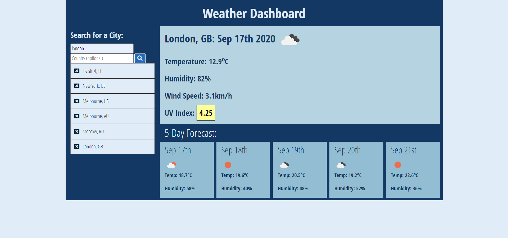

# Weather Dashboard

## Introduction
A weather dashboard web app for world travelers who want to see the weather outlook for multiple cities so they can plan their trip accordingly.

## Description
Travellers can use this web app to help them plan a trip around the world, travellers can look up cities around the world using the form inputs. They are then presented with the current weather information for that city and also the 5 day forecast. The city is then added to a search history list as a button to be looked up again in the future and the city is added to the browsers localStorage.

The current weather displays the city name, date, icon representation of weather conditions, temperature, humidity, wind speed and the UV index. The UV index is presented with a colour to incidate the strength of the UV. The 5 day forecast shows the date, icon representation of the weather conditions, temperature and humidity.

Upon refresh of the browser users are presented with the last viewed location. App is fully responsive and can be viewed on mobiles, tablets and desktops.

## Third Party API

Weather data is obtained through the openweathermap.org API

## Deployed Link

https://conanas.github.io/weather-dashboard/

## Screenshots

